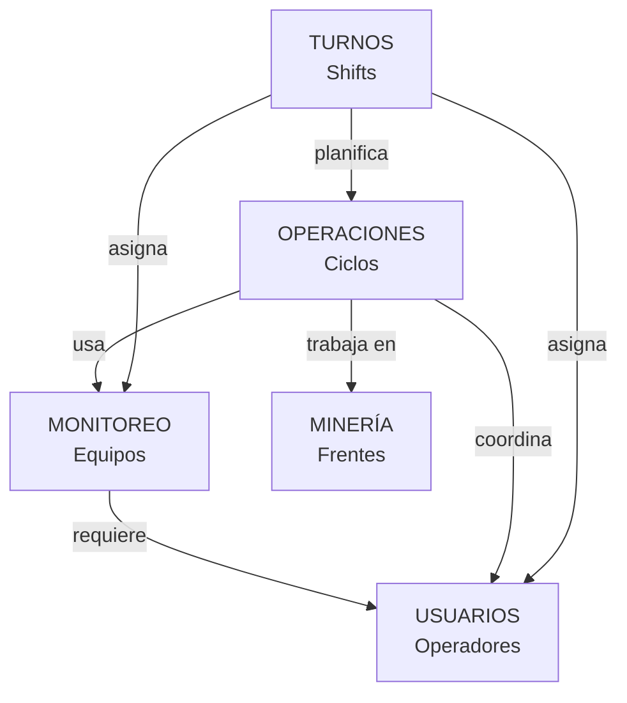

# 📘 PRÁCTICA 07 - GUÍA COMPLETA DE IMPLEMENTACIÓN
# REDISEÑO ARQUITECTÓNICO: MONOLITO → ARQUITECTURA MODULAR DDD

**Universidad Nacional de San Agustín de Arequipa**
**Ingeniería de Software II**
**Sistema de Monitoreo Minero**

---

## 📋 TABLA DE CONTENIDOS

1. [Resumen Ejecutivo](#1-resumen-ejecutivo)
2. [Entorno y Configuración Inicial](#2-entorno-y-configuración-inicial)
3. [Análisis con SonarQube](#3-análisis-con-sonarqube)
4. [Identificación de Módulos y Bounded Contexts](#4-identificación-de-módulos-y-bounded-contexts)
5. [Implementación de Contextos Delimitados](#5-implementación-de-contextos-delimitados)
6. [Incrementar Cobertura de Código (TDD)](#6-incrementar-cobertura-de-código-tdd)
7. [Desacoplar Frontend del Backend](#7-desacoplar-frontend-del-backend)
8. [GitHub Projects e Issues](#8-github-projects-e-issues)
9. [Validación y Entregables](#9-validación-y-entregables)
10. [Anexos y Recursos](#10-anexos-y-recursos)

---

## 1. RESUMEN EJECUTIVO

### 1.1 Estado Actual del Proyecto

Tu **Sistema de Monitoreo Minero** ya tiene una excelente base de Clean Architecture + DDD:

✅ **Fortalezas:**
- Arquitectura en 4 capas bien separadas (Presentación, Aplicación, Dominio, Infraestructura)
- Patrón Repository implementado con interfaces
- Inyección de dependencias correcta
- 82+ pruebas (unitarias e integración)
- API REST funcional para equipos
- SOLID principles parcialmente aplicados

⚠️ **Áreas de Mejora:**
- **Security Hotspot:** Math.random() → ✅ YA CORREGIDO en rama `fix/security-hotspot-math-random`
- **135 Code Smells** (objetivo: <50)
- **Coverage: 43.5%** (objetivo: 80%)
- **11 TODOs** en código de producción
- **6 Interfaces vacías**
- **Contextos incompletos:** Operaciones, Minería, Turnos, Usuarios (solo esqueletos)

### 1.2 Arquitectura Objetivo

```
ARQUITECTURA MODULAR CON DDD (Bounded Contexts)

┌─────────────────────────────────────────────────────────────┐
│                  FRONTEND (Cliente Web)                     │
│                   index.html + JavaScript                   │
└──────────────────────────┬──────────────────────────────────┘
                           │ HTTP/JSON (REST API)
┌──────────────────────────▼──────────────────────────────────┐
│                    API GATEWAY (Express)                    │
│              Rutas: /api/equipos, /api/operaciones...       │
└──────────────────────────┬──────────────────────────────────┘
                           │
        ┌──────────────────┼──────────────────┬───────────────┐
        │                  │                  │               │
┌───────▼────────┐  ┌──────▼──────┐  ┌────────▼──────┐  ┌────▼──────┐
│   CONTEXTO     │  │  CONTEXTO   │  │   CONTEXTO    │  │ CONTEXTO  │
│   MONITOREO    │  │ OPERACIONES │  │   MINERÍA     │  │  TURNOS   │
│   (Equipos)    │  │  (Ciclos)   │  │ (Minas/Frente)│  │  (Shifts) │
├────────────────┤  ├─────────────┤  ├───────────────┤  ├───────────┤
│ Presentación   │  │Presentación │  │ Presentación  │  │Presentaci │
│ Aplicación     │  │Aplicación   │  │ Aplicación    │  │ón Aplicac │
│ Dominio        │  │Dominio      │  │ Dominio       │  │ión Domini │
│ Infraestructura│  │Infraestruct │  │Infraestructura│  │o Infraest │
└────────┬───────┘  └──────┬──────┘  └───────┬───────┘  └─────┬─────┘
         │                 │                 │                │
    ┌────▼────┐       ┌────▼────┐       ┌────▼────┐      ┌───▼────┐
    │   BD    │       │   BD    │       │   BD    │      │   BD   │
    │ Equipos │       │  Ciclos │       │  Minas  │      │ Turnos │
    └─────────┘       └─────────┘       └─────────┘      └────────┘
```

### 1.3 Plan de Trabajo (Duración: 4 horas laboratorio + trabajo continuo)

| Iteración | Tareas | Duración | Prioridad |
|-----------|--------|----------|-----------|
| **1. Análisis** | SonarQube + Revisión Manual | 1h | 🔴 CRÍTICA |
| **2. Corrección Issues** | Security + TODOs + Interfaces Vacías | 2h | 🔴 CRÍTICA |
| **3. Implementar Contextos** | Operaciones, Minería, Turnos | 4h | 🟡 ALTA |
| **4. Aumentar Coverage** | Pruebas TDD hasta 80% | 3h | 🟡 ALTA |
| **5. API REST** | Endpoints para nuevos contextos | 2h | 🟡 ALTA |
| **6. Documentación** | README + Diagramas + GitHub | 1h | 🟢 MEDIA |

---

## 2. ENTORNO Y CONFIGURACIÓN INICIAL

### 2.1 Prerrequisitos

Verifica que tienes todo instalado:

```bash
# Node.js (v18+)
node --version

# npm (v8+)
npm --version

# Git
git --version

# TypeScript
npx tsc --version

# Jest
npx jest --version
```

### 2.2 Herramientas Necesarias

#### **A. SonarQube Server**

**Opción 1 - Docker (Recomendado):**
```bash
# Descargar e iniciar SonarQube
docker run -d --name sonarqube -p 9000:9000 sonarqube:9.9.7-community

# Verificar que está corriendo
docker ps | grep sonarqube
```

**Opción 2 - Instalación Manual:**
1. Descargar: https://www.sonarqube.org/downloads/ (Community Edition 9.9.7)
2. Descomprimir en `C:\SonarQube`
3. Ejecutar: `C:\SonarQube\bin\windows-x86-64\StartSonar.bat`

**Configuración Inicial:**
1. Abrir: http://localhost:9000
2. Login inicial:
   - Usuario: `admin`
   - Contraseña: `admin`
3. Cambiar contraseña cuando se solicite
4. Crear token de acceso:
   - My Account → Security → Generate Token
   - Nombre: `sistema-monitoreo-token`
   - Copiar token generado

#### **B. SonarQube Scanner**

```bash
# Ya está configurado en tu package.json
# Verificar instalación:
npx sonar-scanner --version
```

#### **C. SonarLint (Extensión de VS Code)**

1. Abrir VS Code
2. Ir a Extensions (Ctrl+Shift+X)
3. Buscar: "SonarLint"
4. Instalar extensión oficial
5. Conectar a SonarQube local:
   - `Ctrl+Shift+P` → "SonarLint: Add SonarQube Connection"
   - URL: http://localhost:9000
   - Token: [el token generado anteriormente]

### 2.3 Clonar y Configurar Proyecto

```bash
# 1. Ir al directorio de trabajo
cd c:\Users\bug\Desktop\Wilson

# 2. Verificar estado del repositorio
cd sistema-monitoreo
git status

# 3. Ver ramas existentes
git branch -a

# 4. Asegurarte que estás en development
git checkout development
git pull origin development

# 5. Instalar dependencias (si es necesario)
npm install

# 6. Verificar que las pruebas pasan
npm test

# 7. Ver cobertura actual
npm run test:coverage
```

**Resultado Esperado:**
```
Test Suites: 8 passed, 8 total
Tests:       82 passed, 82 total
Coverage:    43.5% (objetivo: 80%)
```

---

## 3. ANÁLISIS CON SONARQUBE

### 3.1 Configuración de SonarQube Project

Tu archivo `sonar-project.properties` ya está configurado:

```properties
sonar.projectKey=sistema-monitoreo
sonar.projectName=Sistema Monitoreo
sonar.projectVersion=1.0
sonar.sources=aplicacion,Dominio,infraestructura,presentacion
sonar.inclusions=**/*.ts,**/*.js
sonar.exclusions=**/node_modules/**,**/dist/**,**/*.test.ts
sonar.host.url=http://localhost:9000
sonar.token=sqp_ac748557aafb2cdfd4f7e4e926ad425175100d6c
```

### 3.2 Ejecutar Análisis

```bash
# 1. Asegurarse que SonarQube está corriendo
# Abrir: http://localhost:9000

# 2. Compilar proyecto
npm run build

# 3. Ejecutar análisis
npx sonar-scanner

# Esperar mensaje: "ANALYSIS SUCCESSFUL"
```

### 3.3 Ver Resultados en Dashboard

1. Abrir navegador: http://localhost:9000/dashboard?id=sistema-monitoreo
2. Navegar por tabs:
   - **Overview:** Quality Gate, métricas generales
   - **Issues:** Code Smells, Bugs, Vulnerabilities
   - **Security Hotspots:** Revisiones de seguridad
   - **Measures:** Cobertura, duplicaciones, complejidad

### 3.4 Generar Reporte de Issues

**Paso 1: Exportar Issues de SonarQube**

1. Ir a tab **Issues**
2. Aplicar filtros:
   - Type: Code Smell
   - Severity: Blocker, Critical, Major
3. Click en **Export** (esquina superior derecha)
4. Descargar como CSV

**Paso 2: Crear Tabla de Análisis**

Crear archivo: `SONARQUBE-ISSUES-ANALYSIS.md`

```markdown
# Análisis de Issues - SonarQube

## Resumen

| Métrica | Valor Actual | Objetivo | Estado |
|---------|--------------|----------|--------|
| Code Smells | 135 | < 50 | ⚠️ |
| Security Hotspots | 1 | 0 | ⚠️ |
| Bugs | 0 | 0 | ✅ |
| Vulnerabilities | 0 | 0 | ✅ |
| Coverage | 43.5% | 80% | ⚠️ |
| Duplications | 0.0% | < 3% | ✅ |
| Technical Debt | 3h 49min | < 2h | ⚠️ |

## Issues Prioritarios

### 1. Security Hotspot (Prioridad: CRÍTICA)

| Archivo | Línea | Problema | Solución |
|---------|-------|----------|----------|
| CrearEquipo.ts | 142 | Math.random() inseguro | Usar crypto.randomUUID() |

**Estado:** ✅ YA CORREGIDO en rama `fix/security-hotspot-math-random`

### 2. Code Smells - Clases Vacías (Prioridad: ALTA)

| Archivo | Problema | Solución |
|---------|----------|----------|
| iFrenteRepositorio.ts | Interfaz sin métodos | Agregar métodos CRUD |
| iMinaRepositorio.ts | Interfaz sin métodos | Agregar métodos CRUD |
| iMinaServicio.ts | Interfaz sin métodos | Agregar métodos de servicio |
| monitoreoServiciosDominio.ts | Clase vacía | Implementar lógica |

### 3. Code Smells - TODOs (Prioridad: ALTA)

| Archivo | Cantidad | Descripción |
|---------|----------|-------------|
| minaFabrica.ts | 4 | Métodos sin implementar |
| iOperacionRepositorio.ts | 4 | Métodos pendientes |
| operacion.ts | 1 | Lógica de negocio incompleta |

Total: **11 TODOs** en código de producción
```

### 3.5 Revisión Manual de Código

SonarQube no detecta todo. Realiza revisión manual:

```bash
# 1. Buscar todos los TODOs
npx grep -r "TODO" --glob="*.ts" --glob="!**/node_modules/**" --glob="!**/dist/**"

# 2. Buscar interfaces vacías
npx grep -r "export interface" --glob="*.ts" -A 3

# 3. Buscar clases sin métodos
npx grep -r "export class" --glob="*.ts" -A 5
```

**Crear checklist en:** `REVISION-MANUAL-CODIGO.md`

---

## 4. IDENTIFICACIÓN DE MÓDULOS Y BOUNDED CONTEXTS

### 4.1 Lenguaje Ubicuo del Dominio Minero

El vocabulario compartido entre stakeholders (expertos del negocio + desarrolladores):

| Término | Definición | Ejemplo en Código |
|---------|-----------|-------------------|
| **Equipo** | Maquinaria minera de cargue/transporte | `class Equipo` |
| **Volquete** | Camión de transporte de mineral | `class Volquete extends Equipo` |
| **Excavadora** | Equipo de cargue de mineral | `class Excavadora extends Equipo` |
| **Estado** | Condición operativa del equipo | `enum EstadoEquipo` |
| **Operación** | Actividad de cargue/transporte/descarga | `class Operacion` |
| **Ciclo** | Viaje completo: origen → destino | `class Ciclo` |
| **Turno** | Periodo de trabajo (día/noche/madrugada) | `class Turno` |
| **Frente** | Área de extracción activa en la mina | `class Frente` |
| **Mina** | Complejo minero completo | `class Mina` |
| **Supervisor** | Coordina operaciones del turno | `class Supervisor` |
| **Operador** | Maneja un equipo específico | `class Operador` |
| **KPI** | Indicadores de rendimiento (ton/hr) | `calcularKPIs()` |

### 4.2 Identificar Módulos (Funcionalidades de Alto Nivel)

Desde el **punto de vista del usuario** (granularidad gruesa):

```
SISTEMA DE MONITOREO MINERO
│
├─ 1. GESTIÓN DE EQUIPOS
│  └─ Como Supervisor, quiero registrar y monitorear equipos
│     para saber su ubicación y estado en tiempo real
│
├─ 2. GESTIÓN DE OPERACIONES
│  └─ Como Supervisor, quiero planificar y rastrear operaciones de cargue
│     para optimizar el uso de equipos
│
├─ 3. GESTIÓN DE LA MINA
│  └─ Como Administrador, quiero definir frentes de trabajo
│     para organizar las operaciones geográficamente
│
├─ 4. GESTIÓN DE TURNOS
│  └─ Como Supervisor, quiero asignar personal y equipos a turnos
│     para cumplir metas de producción
│
└─ 5. GESTIÓN DE USUARIOS
   └─ Como Administrador, quiero gestionar supervisores y operadores
      para controlar accesos y responsabilidades
```

### 4.3 Definir Bounded Contexts (Contextos Delimitados)

Cada módulo se convierte en un **Bounded Context** con su propio modelo de dominio:

#### **CONTEXTO 1: MONITOREO** ✅ (YA IMPLEMENTADO)

**Responsabilidad:** Gestionar equipos mineros y su estado

**Modelo de Dominio:**
```
Equipo (Agregado Root)
├── Propiedades:
│   ├── id: string
│   ├── codigo: string (único)
│   ├── tipo: enum (VOLQUETE, EXCAVADORA, ...)
│   ├── estado: enum (DISPONIBLE, OPERANDO, ...)
│   ├── nivelCombustible: number (0-100)
│   ├── horasOperacion: number
│   └── historial: HistorialCambio[]
│
├── Comportamientos:
│   ├── cambiarEstado(nuevoEstado)
│   ├── consumirCombustible(cantidad)
│   ├── sumarHorasOperacion(horas)
│   ├── puedeOperar(): boolean
│   └── verificarAlertas(callback)
│
└── Especializaciones:
    ├── Volquete (capacidadCarga, rutaActual)
    └── Excavadora (capacidadBalde, frenteAsignado)

UbicacionGPS (Value Object)
├── latitud: number
├── longitud: number
├── timestamp: Date
└── velocidad: number
```

**Capas:**
- Presentación: `EquipoController`, `equipos.routes.ts`
- Aplicación: `CrearEquipo`, `ObtenerEquipos`
- Dominio: `Equipo.ts`, `IEquipoRepositorio`
- Infraestructura: `MemoriaEquipoRepositorio`

**Estado:** ✅ COMPLETO (100% funcional)

---

#### **CONTEXTO 2: OPERACIONES** ⚠️ (POR IMPLEMENTAR)

**Responsabilidad:** Gestionar operaciones de cargue, transporte y descarga

**Modelo de Dominio:**
```
Operacion (Agregado Root)
├── Propiedades:
│   ├── id: string
│   ├── tipo: enum (CARGUE, TRANSPORTE, DESCARGA)
│   ├── fechaInicio: Date
│   ├── fechaFin?: Date
│   ├── supervisorId: string
│   ├── equiposAsignados: string[]
│   ├── frenteId: string
│   └── kpis: KPIOperacion
│
├── Comportamientos:
│   ├── iniciar()
│   ├── finalizar()
│   ├── asignarEquipo(equipoId)
│   ├── removerEquipo(equipoId)
│   └── calcularKPIs(): KPIOperacion
│
└── Entidades Relacionadas:
    └── Ciclo
        ├── id: string
        ├── operacionId: string
        ├── equipoId: string
        ├── puntoOrigen: UbicacionGPS
        ├── puntoDestino: UbicacionGPS
        ├── horaInicio: Date
        ├── horaFin?: Date
        ├── cargaToneladas: number
        └── calcularDuracion(): number

KPIOperacion (Value Object)
├── tonelajeTotal: number
├── ciclosCompletados: number
├── promedioTonPorCiclo: number
├── tiempoPromedioC iclo: number (minutos)
└── eficiencia: number (%)
```

**Archivos a Crear:**
```
Dominio/operaciones/
├── modelo/
│   ├── Operacion.ts          (entidad agregado root)
│   ├── Ciclo.ts               (entidad)
│   ├── KPIOperacion.ts        (value object)
│   └── TipoOperacion.ts       (enum)
│
├── interfacesRepositorio/
│   ├── IOperacionRepositorio.ts
│   └── ICicloRepositorio.ts
│
└── servicios/
    └── OperacionesServicioDominio.ts

aplicacion/casos-uso/operaciones/
├── IniciarOperacion.ts
├── FinalizarOperacion.ts
├── AsignarEquipoAOperacion.ts
├── CompletarCiclo.ts
└── ObtenerKPIs.ts

presentacion/api/controllers/
└── OperacionesController.ts

infraestructura/persistencia/repositorios/
├── MemoriaOperacionRepositorio.ts
└── MemoriaCicloRepositorio.ts
```

**Estado:** ⚠️ ESQUELETO (solo interfaces vacías)

---

#### **CONTEXTO 3: MINERÍA** ⚠️ (POR IMPLEMENTAR)

**Responsabilidad:** Gestionar la geografía de la mina (frentes, zonas)

**Modelo de Dominio:**
```
Mina (Agregado Root)
├── Propiedades:
│   ├── id: string
│   ├── nombre: string
│   ├── ubicacion: string
│   ├── tipo: enum (SUPERFICIAL, SUBTERRANEA, MIXTA)
│   ├── area: number (hectáreas)
│   └── frentes: Frente[]
│
├── Comportamientos:
│   ├── agregarFrente(frente)
│   ├── desactivarFrente(frenteId)
│   ├── calcularAreaTotal(): number
│   └── obtenerFrentesActivos(): Frente[]
│
└── Entidades Relacionadas:
    ├── Frente
    │   ├── id: string
    │   ├── codigo: string (único por mina)
    │   ├── nombre: string
    │   ├── minaId: string
    │   ├── estado: enum (ACTIVO, INACTIVO, AGOTADO)
    │   ├── coordenadas: Poligono
    │   └── zonas: Zona[]
    │
    └── Zona
        ├── id: string
        ├── nombre: string
        ├── frenteId: string
        ├── tipo: enum (CARGUE, ACOPIO, TRANSITO)
        └── coordenadas: Poligono

Poligono (Value Object)
└── puntos: {lat: number, lng: number}[]
```

**Archivos a Crear:**
```
Dominio/mina/
├── modelo/
│   ├── Mina.ts
│   ├── Frente.ts
│   ├── Zona.ts
│   ├── Poligono.ts
│   └── TipoMina.ts (enum)
│
├── InterfacesRepositorio/
│   ├── IMinaRepositorio.ts
│   ├── IFrenteRepositorio.ts
│   └── IZonaRepositorio.ts
│
└── minaFabrica.ts (Factory Pattern)

aplicacion/casos-uso/mina/
├── CrearMina.ts
├── AgregarFrente.ts
├── ObtenerFrentes.ts
└── ActualizarZona.ts

presentacion/api/controllers/
└── MinaController.ts

infraestructura/persistencia/repositorios/
├── MemoriaMinaRepositorio.ts
└── MemoriaFrenteRepositorio.ts
```

**Estado:** ⚠️ ESQUELETO

---

#### **CONTEXTO 4: TURNOS** ⚠️ (POR IMPLEMENTAR)

**Responsabilidad:** Planificar turnos y asignar personal/equipos

**Modelo de Dominio:**
```
Turno (Agregado Root)
├── Propiedades:
│   ├── id: string
│   ├── tipo: enum (DIA, NOCHE, MADRUGADA)
│   ├── fecha: Date
│   ├── horaInicio: string (formato 24h: "06:00")
│   ├── horaFin: string
│   ├── supervisorId: string
│   ├── operadores: string[] (IDs)
│   ├── equiposAsignados: string[] (IDs)
│   ├── metaProduccion: MetaProduccion
│   └── rendimientoReal?: RendimientoTurno
│
├── Comportamientos:
│   ├── iniciar()
│   ├── finalizar()
│   ├── asignarOperador(operadorId)
│   ├── asignarEquipo(equipoId)
│   ├── calcularRendimiento(): RendimientoTurno
│   └── cumplioMeta(): boolean
│
└── Value Objects:
    ├── MetaProduccion
    │   ├── toneladas: number
    │   ├── ciclosEsperados: number
    │   └── horasOperativas: number
    │
    └── RendimientoTurno
        ├── tonelajeLogrado: number
        ├── ciclosRealizados: number
        ├── porcentajeCumplimiento: number
        └── incidentes: string[]
```

**Archivos a Crear:**
```
Dominio/turno/
├── modelo/
│   ├── Turno.ts
│   ├── MetaProduccion.ts
│   ├── RendimientoTurno.ts
│   └── TipoTurno.ts (enum)
│
├── InterfacesRepositorio/
│   └── ITurnoRepositorio.ts
│
└── servicios/
    └── TurnoServicioDominio.ts

aplicacion/casos-uso/turno/
├── CrearTurno.ts
├── AsignarPersonalATurno.ts
├── FinalizarTurno.ts
└── GenerarReporteTurno.ts

presentacion/api/controllers/
└── TurnoController.ts

infraestructura/persistencia/repositorios/
└── MemoriaTurnoRepositorio.ts
```

**Estado:** ⚠️ ESQUELETO

---

#### **CONTEXTO 5: USUARIOS** ⚠️ (POR IMPLEMENTAR)

**Responsabilidad:** Gestionar supervisores, operadores y permisos

**Modelo de Dominio:**
```
Persona (Clase Base Abstracta)
├── Propiedades:
│   ├── id: string
│   ├── nombre: string
│   ├── apellidos: string
│   ├── documento: string (DNI/RUC)
│   ├── email: string
│   ├── telefono: string
│   └── estado: enum (ACTIVO, INACTIVO, SUSPENDIDO)
│
├── Especializaciones:
│   ├── Supervisor
│   │   ├── turnosAsignados: string[]
│   │   ├── certificaciones: string[]
│   │   └── autorizarOperacion(operacionId)
│   │
│   └── Operador
│       ├── equipoActual?: string
│       ├── licenciaConducir: string
│       ├── fechaVencimientoLicencia: Date
│       └── puedeOperarEquipo(tipoEquipo): boolean
│
└── Comportamientos Comunes:
    ├── validarEstadoActivo(): boolean
    └── obtenerInformacionCompleta(): PersonaDto
```

**Archivos a Crear:**
```
Dominio/usuarios/
├── modelo/
│   ├── Persona.ts (abstracta)
│   ├── Supervisor.ts
│   ├── Operador.ts
│   └── EstadoPersona.ts (enum)
│
├── InteracesRepositorio/
│   └── IUsuarioRepositorio.ts
│
└── servicios/
    └── UsuariosServicioDominio.ts

aplicacion/casos-uso/usuarios/
├── RegistrarSupervisor.ts
├── RegistrarOperador.ts
├── AsignarEquipoAOperador.ts
└── ObtenerUsuarios.ts

presentacion/api/controllers/
└── UsuariosController.ts

infraestructura/persistencia/repositorios/
└── MemoriaUsuarioRepositorio.ts
```

**Estado:** ⚠️ ESQUELETO

---

### 4.4 Dependencias Entre Contextos



**Reglas de Dependencia:**
1. OPERACIONES depende de MONITOREO (necesita equipos)
2. OPERACIONES depende de MINERÍA (necesita frentes)
3. TURNOS depende de USUARIOS (necesita supervisores/operadores)
4. TURNOS depende de MONITOREO (necesita equipos)
5. NINGÚN contexto debe conocer detalles de implementación de otros

---

## 5. IMPLEMENTACIÓN DE CONTEXTOS DELIMITADOS

### 5.1 Flujo de Trabajo TDD (Test-Driven Development)

Para cada contexto, seguir ciclo **RED → GREEN → REFACTOR**:

```
1. RED (Prueba que falla)
   └─ Escribir test ANTES del código
   └─ Ejecutar: npm test
   └─ Resultado: ❌ FALLA (esperado)

2. GREEN (Código mínimo)
   └─ Escribir código mínimo para pasar test
   └─ Ejecutar: npm test
   └─ Resultado: ✅ PASA

3. REFACTOR (Mejorar código)
   └─ Limpiar código manteniendo tests verdes
   └─ Aplicar SOLID principles
   └─ Ejecutar: npm test
   └─ Resultado: ✅ PASA (sin regresiones)
```

### 5.2 Implementar Contexto de OPERACIONES (Ejemplo Completo)

#### **Paso 1: Crear Estructura de Carpetas**

```bash
# Dominio
mkdir -p Dominio/operaciones/modelo
mkdir -p Dominio/operaciones/interfacesRepositorio
mkdir -p Dominio/operaciones/servicios

# Aplicación
mkdir -p aplicacion/casos-uso/operaciones

# Infraestructura
mkdir -p infraestructura/persistencia/repositorios

# Presentación
# (ya existe presentacion/api/controllers)

# Tests
mkdir -p Dominio/operaciones/__tests__
mkdir -p aplicacion/casos-uso/operaciones/__tests__
```

#### **Paso 2: Implementar Entidad del Dominio (TDD)**

**RED - Escribir test primero:**

Crear: `Dominio/operaciones/__tests__/Operacion.test.ts`

```typescript
import { Operacion } from '../modelo/Operacion';

describe('Operacion - Entidad de Dominio', () => {

    describe('Constructor e Invariantes', () => {
        it('debe crear una operación válida con datos correctos', () => {
            // Arrange & Act
            const operacion = new Operacion(
                'op-001',
                'CARGUE',
                'sup-123',
                'frente-norte-01'
            );

            // Assert
            expect(operacion.id).toBe('op-001');
            expect(operacion.tipo).toBe('CARGUE');
            expect(operacion.supervisorId).toBe('sup-123');
            expect(operacion.frenteId).toBe('frente-norte-01');
            expect(operacion.fechaInicio).toBeInstanceOf(Date);
            expect(operacion.fechaFin).toBeUndefined();
            expect(operacion.equiposAsignados).toEqual([]);
        });

        it('debe lanzar error si el tipo es inválido', () => {
            expect(() => {
                new Operacion('op-001', 'TIPO_INVALIDO', 'sup-123', 'frente-01');
            }).toThrow('Tipo de operación inválido');
        });

        it('debe lanzar error si supervisorId está vacío', () => {
            expect(() => {
                new Operacion('op-001', 'CARGUE', '', 'frente-01');
            }).toThrow('El supervisor es obligatorio');
        });
    });

    describe('Asignar y Remover Equipos', () => {
        it('debe asignar un equipo correctamente', () => {
            const operacion = new Operacion('op-001', 'CARGUE', 'sup-123', 'frente-01');

            operacion.asignarEquipo('equipo-vol-001');

            expect(operacion.equiposAsignados).toContain('equipo-vol-001');
            expect(operacion.equiposAsignados.length).toBe(1);
        });

        it('debe evitar asignar el mismo equipo dos veces', () => {
            const operacion = new Operacion('op-001', 'CARGUE', 'sup-123', 'frente-01');

            operacion.asignarEquipo('equipo-vol-001');
            operacion.asignarEquipo('equipo-vol-001');

            expect(operacion.equiposAsignados.length).toBe(1);
        });

        it('debe remover un equipo correctamente', () => {
            const operacion = new Operacion('op-001', 'CARGUE', 'sup-123', 'frente-01');
            operacion.asignarEquipo('equipo-vol-001');

            operacion.removerEquipo('equipo-vol-001');

            expect(operacion.equiposAsignados).not.toContain('equipo-vol-001');
        });
    });

    describe('Iniciar y Finalizar Operación', () => {
        it('debe marcar operación como iniciada', () => {
            const operacion = new Operacion('op-001', 'CARGUE', 'sup-123', 'frente-01');

            operacion.iniciar();

            expect(operacion.fechaInicio).toBeInstanceOf(Date);
        });

        it('debe marcar operación como finalizada', () => {
            const operacion = new Operacion('op-001', 'CARGUE', 'sup-123', 'frente-01');
            operacion.iniciar();

            operacion.finalizar();

            expect(operacion.fechaFin).toBeInstanceOf(Date);
            expect(operacion.fechaFin!.getTime()).toBeGreaterThan(
                operacion.fechaInicio.getTime()
            );
        });

        it('debe lanzar error si se intenta finalizar antes de iniciar', () => {
            const operacion = new Operacion('op-001', 'CARGUE', 'sup-123', 'frente-01');

            expect(() => {
                operacion.finalizar();
            }).toThrow('No se puede finalizar una operación que no ha iniciado');
        });
    });

    describe('Calcular Duración', () => {
        it('debe calcular duración en minutos correctamente', () => {
            const operacion = new Operacion('op-001', 'CARGUE', 'sup-123', 'frente-01');
            operacion.iniciar();

            // Simular 30 minutos después
            jest.advanceTimersByTime(30 * 60 * 1000);
            operacion.finalizar();

            const duracion = operacion.calcularDuracion();

            expect(duracion).toBe(30);
        });

        it('debe retornar 0 si no ha finalizado', () => {
            const operacion = new Operacion('op-001', 'CARGUE', 'sup-123', 'frente-01');
            operacion.iniciar();

            const duracion = operacion.calcularDuracion();

            expect(duracion).toBe(0);
        });
    });
});
```

**Ejecutar test (debe FALLAR):**
```bash
npm test -- Operacion.test.ts
# ❌ Cannot find module '../modelo/Operacion'
```

---

**GREEN - Implementar código mínimo:**

Crear: `Dominio/operaciones/modelo/TipoOperacion.ts`

```typescript
/**
 * Tipos de operaciones en la mina
 */
export const TIPOS_OPERACION = {
    CARGUE: 'CARGUE',
    TRANSPORTE: 'TRANSPORTE',
    DESCARGA: 'DESCARGA',
} as const;

export type TipoOperacion = typeof TIPOS_OPERACION[keyof typeof TIPOS_OPERACION];
```

Crear: `Dominio/operaciones/modelo/Operacion.ts`

```typescript
import { TipoOperacion, TIPOS_OPERACION } from './TipoOperacion';

/**
 * Operacion - Entidad del Dominio
 *
 * Representa una actividad de cargue, transporte o descarga
 * en la mina. Es el Agregado Root del contexto de Operaciones.
 */
export class Operacion {
    // Propiedades privadas (encapsulación)
    private _id: string;
    private _tipo: TipoOperacion;
    private _fechaInicio: Date;
    private _fechaFin?: Date;
    private _supervisorId: string;
    private _frenteId: string;
    private _equiposAsignados: string[];

    constructor(
        id: string,
        tipo: string,
        supervisorId: string,
        frenteId: string
    ) {
        // Validaciones (invariantes del dominio)
        this.validarTipo(tipo);
        this.validarSupervisor(supervisorId);
        this.validarFrente(frenteId);

        this._id = id;
        this._tipo = tipo as TipoOperacion;
        this._supervisorId = supervisorId;
        this._frenteId = frenteId;
        this._fechaInicio = new Date();
        this._equiposAsignados = [];

        console.log(`📋 Operación ${tipo} creada: ${id}`);
    }

    // Getters (solo lectura desde fuera)
    get id(): string {
        return this._id;
    }

    get tipo(): TipoOperacion {
        return this._tipo;
    }

    get fechaInicio(): Date {
        return this._fechaInicio;
    }

    get fechaFin(): Date | undefined {
        return this._fechaFin;
    }

    get supervisorId(): string {
        return this._supervisorId;
    }

    get frenteId(): string {
        return this._frenteId;
    }

    get equiposAsignados(): string[] {
        // Retornar copia para evitar mutaciones externas
        return [...this._equiposAsignados];
    }

    // Comportamientos del Dominio

    /**
     * Iniciar la operación (marcar timestamp)
     */
    iniciar(): void {
        this._fechaInicio = new Date();
        console.log(`▶️ Operación ${this._id} iniciada`);
    }

    /**
     * Finalizar la operación
     */
    finalizar(): void {
        if (!this._fechaInicio) {
            throw new Error('No se puede finalizar una operación que no ha iniciado');
        }

        this._fechaFin = new Date();
        console.log(`✅ Operación ${this._id} finalizada`);
    }

    /**
     * Asignar un equipo a la operación
     */
    asignarEquipo(equipoId: string): void {
        // Evitar duplicados
        if (!this._equiposAsignados.includes(equipoId)) {
            this._equiposAsignados.push(equipoId);
            console.log(`➕ Equipo ${equipoId} asignado a operación ${this._id}`);
        }
    }

    /**
     * Remover un equipo de la operación
     */
    removerEquipo(equipoId: string): void {
        const index = this._equiposAsignados.indexOf(equipoId);
        if (index > -1) {
            this._equiposAsignados.splice(index, 1);
            console.log(`➖ Equipo ${equipoId} removido de operación ${this._id}`);
        }
    }

    /**
     * Calcular duración de la operación en minutos
     */
    calcularDuracion(): number {
        if (!this._fechaFin) {
            return 0;
        }

        const diffMs = this._fechaFin.getTime() - this._fechaInicio.getTime();
        const diffMinutos = Math.floor(diffMs / (1000 * 60));
        return diffMinutos;
    }

    // Validaciones privadas

    private validarTipo(tipo: string): void {
        const tiposValidos = Object.values(TIPOS_OPERACION);
        if (!tiposValidos.includes(tipo as TipoOperacion)) {
            throw new Error(
                `Tipo de operación inválido: ${tipo}. Tipos válidos: ${tiposValidos.join(', ')}`
            );
        }
    }

    private validarSupervisor(supervisorId: string): void {
        if (!supervisorId || supervisorId.trim().length === 0) {
            throw new Error('El supervisor es obligatorio');
        }
    }

    private validarFrente(frenteId: string): void {
        if (!frenteId || frenteId.trim().length === 0) {
            throw new Error('El frente de trabajo es obligatorio');
        }
    }

    /**
     * Obtener información completa de la operación
     */
    obtenerInfo(): any {
        return {
            id: this._id,
            tipo: this._tipo,
            supervisorId: this._supervisorId,
            frenteId: this._frenteId,
            fechaInicio: this._fechaInicio.toISOString(),
            fechaFin: this._fechaFin?.toISOString(),
            equiposAsignados: this.equiposAsignados,
            duracionMinutos: this.calcularDuracion(),
        };
    }
}
```

**Ejecutar test (debe PASAR):**
```bash
npm test -- Operacion.test.ts
# ✅ PASS  Dominio/operaciones/__tests__/Operacion.test.ts
#   13 passed, 13 total
```

---

**REFACTOR - Mejorar código:**

1. Agregar JSDoc a métodos públicos ✅
2. Extraer constantes mágicas ✅
3. Aplicar SRP (cada método hace una cosa) ✅
4. Encapsulación correcta (getters sin setters) ✅

```bash
npm test
# ✅ Todo sigue pasando
```

---

#### **Paso 3: Implementar Repositorio (Interface + Implementación)**

**Crear interfaz:** `Dominio/operaciones/interfacesRepositorio/IOperacionRepositorio.ts`

```typescript
import { Operacion } from '../modelo/Operacion';

/**
 * Repositorio de Operaciones
 *
 * Patrón Repository - Abstracción de persistencia
 * siguiendo Dependency Inversion Principle (DIP)
 */
export interface IOperacionRepositorio {
    /**
     * Crear nueva operación
     */
    crear(operacion: Operacion): Promise<void>;

    /**
     * Obtener operación por ID
     */
    obtenerPorId(id: string): Promise<Operacion | null>;

    /**
     * Obtener todas las operaciones
     */
    obtenerTodas(): Promise<Operacion[]>;

    /**
     * Obtener operaciones por supervisor
     */
    obtenerPorSupervisor(supervisorId: string): Promise<Operacion[]>;

    /**
     * Obtener operaciones por frente
     */
    obtenerPorFrente(frenteId: string): Promise<Operacion[]>;

    /**
     * Obtener operaciones activas (sin finalizar)
     */
    obtenerActivas(): Promise<Operacion[]>;

    /**
     * Actualizar operación existente
     */
    actualizar(operacion: Operacion): Promise<void>;

    /**
     * Eliminar operación
     */
    eliminar(id: string): Promise<void>;
}
```

**Crear implementación en memoria:** `infraestructura/persistencia/repositorios/MemoriaOperacionRepositorio.ts`

```typescript
import { IOperacionRepositorio } from '../../../Dominio/operaciones/interfacesRepositorio/IOperacionRepositorio';
import { Operacion } from '../../../Dominio/operaciones/modelo/Operacion';

/**
 * Implementación en memoria del repositorio de operaciones
 * (para desarrollo y testing)
 */
export class MemoriaOperacionRepositorio implements IOperacionRepositorio {
    private operaciones: Map<string, Operacion> = new Map();

    async crear(operacion: Operacion): Promise<void> {
        if (this.operaciones.has(operacion.id)) {
            throw new Error(`Ya existe una operación con ID: ${operacion.id}`);
        }

        this.operaciones.set(operacion.id, operacion);
        console.log(`💾 Operación guardada en memoria: ${operacion.id}`);
    }

    async obtenerPorId(id: string): Promise<Operacion | null> {
        return this.operaciones.get(id) || null;
    }

    async obtenerTodas(): Promise<Operacion[]> {
        return Array.from(this.operaciones.values());
    }

    async obtenerPorSupervisor(supervisorId: string): Promise<Operacion[]> {
        return Array.from(this.operaciones.values())
            .filter(op => op.supervisorId === supervisorId);
    }

    async obtenerPorFrente(frenteId: string): Promise<Operacion[]> {
        return Array.from(this.operaciones.values())
            .filter(op => op.frenteId === frenteId);
    }

    async obtenerActivas(): Promise<Operacion[]> {
        return Array.from(this.operaciones.values())
            .filter(op => !op.fechaFin);
    }

    async actualizar(operacion: Operacion): Promise<void> {
        if (!this.operaciones.has(operacion.id)) {
            throw new Error(`Operación con ID ${operacion.id} no encontrada`);
        }

        this.operaciones.set(operacion.id, operacion);
        console.log(`💾 Operación actualizada: ${operacion.id}`);
    }

    async eliminar(id: string): Promise<void> {
        if (!this.operaciones.has(id)) {
            throw new Error(`Operación con ID ${id} no encontrada`);
        }

        this.operaciones.delete(id);
        console.log(`🗑️ Operación eliminada: ${id}`);
    }

    // Método auxiliar para testing
    async limpiar(): Promise<void> {
        this.operaciones.clear();
    }
}
```

---

#### **Paso 4: Implementar Caso de Uso**

**Crear:** `aplicacion/casos-uso/operaciones/IniciarOperacion.ts`

```typescript
import { randomUUID } from 'crypto';
import { IOperacionRepositorio } from '../../../Dominio/operaciones/interfacesRepositorio/IOperacionRepositorio';
import { Operacion } from '../../../Dominio/operaciones/modelo/Operacion';

/**
 * Caso de Uso: Iniciar Nueva Operación
 *
 * Capa de Aplicación - Orquesta la lógica de negocio
 */
export class IniciarOperacion {
    constructor(
        private readonly operacionRepositorio: IOperacionRepositorio
    ) {
        console.log('📋 IniciarOperacion: Caso de uso inicializado');
    }

    /**
     * Ejecutar caso de uso
     *
     * @param tipo - Tipo de operación (CARGUE, TRANSPORTE, DESCARGA)
     * @param supervisorId - ID del supervisor responsable
     * @param frenteId - ID del frente de trabajo
     * @returns ID de la operación creada
     */
    async ejecutar(
        tipo: string,
        supervisorId: string,
        frenteId: string
    ): Promise<string> {
        try {
            console.log(`📝 Iniciando operación: ${tipo} en frente ${frenteId}`);

            // 1. Validar datos de entrada (capa de aplicación)
            this.validarDatosDeEntrada(tipo, supervisorId, frenteId);

            // 2. Generar ID único y seguro
            const id = this.generarIdUnico();

            // 3. Crear entidad de dominio (el dominio valida sus propias reglas)
            const operacion = new Operacion(id, tipo, supervisorId, frenteId);

            // 4. Persistir
            await this.operacionRepositorio.crear(operacion);

            console.log(`✅ Operación creada exitosamente: ${id}`);
            return id;

        } catch (error: any) {
            console.error(`❌ Error en caso de uso IniciarOperacion: ${error.message}`);
            throw new Error(`Error al iniciar operación: ${error.message}`);
        }
    }

    private validarDatosDeEntrada(
        tipo: string,
        supervisorId: string,
        frenteId: string
    ): void {
        if (!tipo || tipo.trim().length === 0) {
            throw new Error('El tipo de operación es obligatorio');
        }

        if (!supervisorId || supervisorId.trim().length === 0) {
            throw new Error('El supervisor es obligatorio');
        }

        if (!frenteId || frenteId.trim().length === 0) {
            throw new Error('El frente de trabajo es obligatorio');
        }
    }

    private generarIdUnico(): string {
        const id = `operacion-${randomUUID()}`;
        console.log(`🆔 ID generado (UUID v4): ${id}`);
        return id;
    }
}
```

**Crear test:** `aplicacion/casos-uso/operaciones/__tests__/IniciarOperacion.test.ts`

```typescript
import { IniciarOperacion } from '../IniciarOperacion';
import { IOperacionRepositorio } from '../../../../Dominio/operaciones/interfacesRepositorio/IOperacionRepositorio';
import { Operacion } from '../../../../Dominio/operaciones/modelo/Operacion';

describe('IniciarOperacion - Caso de Uso', () => {
    let mockRepositorio: jest.Mocked<IOperacionRepositorio>;
    let casoDeUso: IniciarOperacion;

    beforeEach(() => {
        // Mock del repositorio
        mockRepositorio = {
            crear: jest.fn(),
            obtenerPorId: jest.fn(),
            obtenerTodas: jest.fn(),
            obtenerPorSupervisor: jest.fn(),
            obtenerPorFrente: jest.fn(),
            obtenerActivas: jest.fn(),
            actualizar: jest.fn(),
            eliminar: jest.fn(),
        } as any;

        casoDeUso = new IniciarOperacion(mockRepositorio);
    });

    describe('Casos Exitosos', () => {
        it('debe crear una operación de CARGUE exitosamente', async () => {
            // Arrange
            mockRepositorio.crear.mockResolvedValue(undefined);

            // Act
            const id = await casoDeUso.ejecutar('CARGUE', 'sup-123', 'frente-norte');

            // Assert
            expect(id).toMatch(/^operacion-[0-9a-f-]+$/);
            expect(mockRepositorio.crear).toHaveBeenCalledTimes(1);

            const operacionCreada = mockRepositorio.crear.mock.calls[0][0];
            expect(operacionCreada).toBeInstanceOf(Operacion);
            expect(operacionCreada.tipo).toBe('CARGUE');
        });

        it('debe generar IDs únicos en múltiples llamadas', async () => {
            mockRepositorio.crear.mockResolvedValue(undefined);

            const id1 = await casoDeUso.ejecutar('CARGUE', 'sup-1', 'frente-1');
            const id2 = await casoDeUso.ejecutar('TRANSPORTE', 'sup-2', 'frente-2');

            expect(id1).not.toBe(id2);
        });
    });

    describe('Validaciones', () => {
        it('debe lanzar error si el tipo está vacío', async () => {
            await expect(
                casoDeUso.ejecutar('', 'sup-123', 'frente-norte')
            ).rejects.toThrow('El tipo de operación es obligatorio');
        });

        it('debe lanzar error si el supervisor está vacío', async () => {
            await expect(
                casoDeUso.ejecutar('CARGUE', '', 'frente-norte')
            ).rejects.toThrow('El supervisor es obligatorio');
        });

        it('debe lanzar error si el frente está vacío', async () => {
            await expect(
                casoDeUso.ejecutar('CARGUE', 'sup-123', '')
            ).rejects.toThrow('El frente de trabajo es obligatorio');
        });

        it('debe lanzar error si el tipo es inválido', async () => {
            await expect(
                casoDeUso.ejecutar('TIPO_INVALIDO', 'sup-123', 'frente-norte')
            ).rejects.toThrow('Tipo de operación inválido');
        });
    });

    describe('Manejo de Errores', () => {
        it('debe propagar errores del repositorio', async () => {
            mockRepositorio.crear.mockRejectedValue(new Error('Error de BD'));

            await expect(
                casoDeUso.ejecutar('CARGUE', 'sup-123', 'frente-norte')
            ).rejects.toThrow('Error al iniciar operación');
        });
    });
});
```

**Ejecutar:**
```bash
npm test -- IniciarOperacion.test.ts
# ✅ PASS (12 tests)
```

---

#### **Paso 5: Crear Controller y Rutas**

**Crear:** `presentacion/api/controllers/OperacionesController.ts`

```typescript
import { Request, Response } from 'express';
import { IniciarOperacion } from '../../../aplicacion/casos-uso/operaciones/IniciarOperacion';

/**
 * Controller REST para Operaciones
 *
 * Responsabilidades:
 * - Manejar requests HTTP
 * - Validar datos de entrada
 * - Coordinar casos de uso
 * - Formatear respuestas JSON
 */
export class OperacionesController {
    constructor(
        private readonly iniciarOperacionUseCase: IniciarOperacion
    ) {
        console.log('🎮 OperacionesController inicializado');
    }

    /**
     * POST /api/operaciones
     * Crear nueva operación
     */
    async crear(req: Request, res: Response): Promise<void> {
        try {
            const { tipo, supervisorId, frenteId } = req.body;

            // Validar entrada HTTP
            const errores = this.validarDatosCreacion(tipo, supervisorId, frenteId);
            if (errores.length > 0) {
                res.status(400).json(this.crearRespuestaError(errores));
                return;
            }

            // Ejecutar caso de uso
            const operacionId = await this.iniciarOperacionUseCase.ejecutar(
                tipo,
                supervisorId,
                frenteId
            );

            // Respuesta exitosa
            res.status(201).json({
                success: true,
                message: 'Operación iniciada exitosamente',
                timestamp: new Date().toISOString(),
                data: {
                    id: operacionId,
                    tipo,
                    supervisorId,
                    frenteId,
                },
            });

        } catch (error: any) {
            this.manejarError(res, error);
        }
    }

    // Métodos privados de validación y formato

    private validarDatosCreacion(
        tipo: any,
        supervisorId: any,
        frenteId: any
    ): string[] {
        const errores: string[] = [];

        if (!tipo || typeof tipo !== 'string') {
            errores.push('El tipo de operación es obligatorio y debe ser texto');
        }

        if (!supervisorId || typeof supervisorId !== 'string') {
            errores.push('El ID del supervisor es obligatorio');
        }

        if (!frenteId || typeof frenteId !== 'string') {
            errores.push('El ID del frente es obligatorio');
        }

        return errores;
    }

    private crearRespuestaError(errores: string[]): any {
        return {
            success: false,
            message: 'Errores de validación',
            timestamp: new Date().toISOString(),
            errors: errores,
        };
    }

    private manejarError(res: Response, error: any): void {
        console.error('❌ Error en OperacionesController:', error.message);

        // Determinar código de error HTTP
        let statusCode = 500;
        let mensaje = 'Error interno del servidor';

        if (error.message.includes('inválido')) {
            statusCode = 400;
            mensaje = error.message;
        }

        res.status(statusCode).json({
            success: false,
            message: mensaje,
            timestamp: new Date().toISOString(),
        });
    }
}
```

**Crear rutas:** `presentacion/api/routes/operaciones.routes.ts`

```typescript
import { Router } from 'express';
import { OperacionesController } from '../controllers/OperacionesController';

export function crearRutasOperaciones(controller: OperacionesController): Router {
    const router = Router();

    // POST /api/operaciones
    router.post('/', (req, res) => controller.crear(req, res));

    console.log('🛣️ Rutas de operaciones configuradas');
    return router;
}
```

**Actualizar:** `aplicacion/server.ts`

```typescript
// ... imports existentes ...
import { crearRutasOperaciones } from '../presentacion/api/routes/operaciones.routes';
import { OperacionesController } from '../presentacion/api/controllers/OperacionesController';
import { IniciarOperacion } from './casos-uso/operaciones/IniciarOperacion';
import { MemoriaOperacionRepositorio } from '../infraestructura/persistencia/repositorios/MemoriaOperacionRepositorio';

// ... código existente ...

// En el método inicializar() agregar:

// Operaciones
const operacionRepo = new MemoriaOperacionRepositorio();
const iniciarOperacionUseCase = new IniciarOperacion(operacionRepo);
const operacionesController = new OperacionesController(iniciarOperacionUseCase);

const rutasOperaciones = crearRutasOperaciones(operacionesController);
this.app.use('/api/operaciones', rutasOperaciones);
```

**Probar con curl:**
```bash
# Iniciar servidor
npm run dev

# En otra terminal:
curl -X POST http://localhost:3000/api/operaciones \
  -H "Content-Type: application/json" \
  -d '{
    "tipo": "CARGUE",
    "supervisorId": "sup-123",
    "frenteId": "frente-norte-01"
  }'

# Respuesta esperada:
# {
#   "success": true,
#   "message": "Operación iniciada exitosamente",
#   "data": {
#     "id": "operacion-uuid-generado",
#     "tipo": "CARGUE",
#     ...
#   }
# }
```

---

### 5.3 Implementar Contextos Restantes

Repite el proceso anterior (Pasos 1-5) para:

1. **Contexto MINERÍA:**
   - Entidades: `Mina.ts`, `Frente.ts`, `Zona.ts`
   - Repositorios: `IMinaRepositorio.ts`, `MemoriaMinaRepositorio.ts`
   - Use Cases: `CrearMina.ts`, `AgregarFrente.ts`
   - Controller: `MinaController.ts`

2. **Contexto TURNOS:**
   - Entidades: `Turno.ts`, `MetaProduccion.ts`
   - Repositorios: `ITurnoRepositorio.ts`, `MemoriaTurnoRepositorio.ts`
   - Use Cases: `CrearTurno.ts`, `AsignarPersonal.ts`
   - Controller: `TurnoController.ts`

3. **Contexto USUARIOS:**
   - Entidades: `Persona.ts`, `Supervisor.ts`, `Operador.ts`
   - Repositorios: `IUsuarioRepositorio.ts`
   - Use Cases: `RegistrarSupervisor.ts`, `RegistrarOperador.ts`
   - Controller: `UsuariosController.ts`

---

## 6. INCREMENTAR COBERTURA DE CÓDIGO (TDD)

### 6.1 Ver Cobertura Actual

```bash
npm run test:coverage
```

**Resultado Actual:**
```
-----------------------------|---------|----------|---------|---------|
File                         | % Stmts | % Branch | % Funcs | % Lines |
-----------------------------|---------|----------|---------|---------|
All files                    |   43.5  |    38.2  |   45.1  |   44.3  |
-----------------------------|---------|----------|---------|---------|
```

**Objetivo:** 80% en todas las métricas

### 6.2 Identificar Archivos Sin Cobertura

```bash
# Ver reporte HTML detallado
npm run test:coverage
# Abrir: coverage/lcov-report/index.html
```

**Archivos prioritarios (0% coverage):**
```
📂 aplicacion/casos-uso/monitoreo/
  ├── ActualizarEstadoEquipo.ts        0%
  └── ObtenerUbicacionTiempoReal.ts    0%

📂 aplicacion/casos-uso/operaciones/
  ├── CompletarCicloTransporte.ts      0%
  └── (los que acabas de crear)
```

### 6.3 Ejemplo: Crear Tests para ActualizarEstadoEquipo

**Paso 1: Diseñar Tabla de Casos de Prueba**

| ID | Escenario | Entrada | Resultado Esperado |
|----|-----------|---------|-------------------|
| TC01 | Caso exitoso | equipoId válido, estado "OPERANDO" | Estado actualizado, sin error |
| TC02 | Equipo no encontrado | ID inexistente | Error "no encontrado" |
| TC03 | ID vacío | "", "OPERANDO" | Error "ID obligatorio" |
| TC04 | Estado vacío | "eq-123", "" | Error "estado obligatorio" |
| TC05 | Transición inválida | DISPONIBLE → INACTIVO (no permitido) | Error de dominio |
| TC06 | Transición válida | DISPONIBLE → OPERANDO | Estado cambiado |
| TC07 | Transición válida | OPERANDO → MANTENIMIENTO | Estado cambiado |

**Paso 2: Implementar Tests (Patrón AAA)**

Crear: `aplicacion/casos-uso/monitoreo/__tests__/ActualizarEstadoEquipo.test.ts`

```typescript
import { ActualizarEstadoEquipo } from '../ActualizarEstadoEquipo';
import { IEquipoRepositorio } from '../../../../Dominio/monitoreo/interfacesRepositorio/iEquipoRepositorio';
import { Equipo } from '../../../../Dominio/monitoreo/Equipo';

describe('ActualizarEstadoEquipo - Caso de Uso', () => {
    let mockRepositorio: jest.Mocked<IEquipoRepositorio>;
    let casoDeUso: ActualizarEstadoEquipo;
    let equipoMock: Equipo;

    beforeEach(() => {
        // Arrange - Configuración común
        mockRepositorio = {
            obtenerPorId: jest.fn(),
            actualizar: jest.fn(),
            obtenerTodos: jest.fn(),
            crear: jest.fn(),
            eliminar: jest.fn(),
            buscarPorTipo: jest.fn(),
            buscarPorEstado: jest.fn(),
            existeConCodigo: jest.fn(),
        } as any;

        casoDeUso = new ActualizarEstadoEquipo(mockRepositorio);

        // Equipo mock en estado DISPONIBLE
        equipoMock = new Equipo(
            'equipo-123',
            'EQ-001',
            'VOLQUETE',
            100,
            0
        );
    });

    describe('TC01: Caso exitoso', () => {
        it('debe actualizar el estado del equipo correctamente', async () => {
            // Arrange
            mockRepositorio.obtenerPorId.mockResolvedValue(equipoMock);
            mockRepositorio.actualizar.mockResolvedValue(undefined);

            // Act
            await casoDeUso.ejecutar('equipo-123', 'OPERANDO');

            // Assert
            expect(mockRepositorio.obtenerPorId).toHaveBeenCalledWith('equipo-123');
            expect(equipoMock.estado).toBe('OPERANDO');
            expect(mockRepositorio.actualizar).toHaveBeenCalledWith(equipoMock);
        });
    });

    describe('TC02: Equipo no encontrado', () => {
        it('debe lanzar error si el equipo no existe', async () => {
            // Arrange
            mockRepositorio.obtenerPorId.mockResolvedValue(null);

            // Act & Assert
            await expect(
                casoDeUso.ejecutar('eq-inexistente', 'OPERANDO')
            ).rejects.toThrow('Equipo con ID eq-inexistente no encontrado');
        });
    });

    describe('TC03: Validación de ID vacío', () => {
        it('debe lanzar error si el ID está vacío', async () => {
            await expect(
                casoDeUso.ejecutar('', 'OPERANDO')
            ).rejects.toThrow('El ID del equipo es obligatorio');
        });

        it('debe lanzar error si el ID es solo espacios', async () => {
            await expect(
                casoDeUso.ejecutar('   ', 'OPERANDO')
            ).rejects.toThrow('El ID del equipo es obligatorio');
        });
    });

    describe('TC04: Validación de estado vacío', () => {
        it('debe lanzar error si el estado está vacío', async () => {
            await expect(
                casoDeUso.ejecutar('equipo-123', '')
            ).rejects.toThrow('El nuevo estado es obligatorio');
        });
    });

    describe('TC05-TC07: Transiciones de estado', () => {
        it('TC06: debe permitir transición DISPONIBLE → OPERANDO', async () => {
            equipoMock.cambiarEstado('DISPONIBLE');
            mockRepositorio.obtenerPorId.mockResolvedValue(equipoMock);
            mockRepositorio.actualizar.mockResolvedValue(undefined);

            await casoDeUso.ejecutar('equipo-123', 'OPERANDO');

            expect(equipoMock.estado).toBe('OPERANDO');
        });

        it('TC07: debe permitir transición OPERANDO → MANTENIMIENTO', async () => {
            equipoMock.cambiarEstado('OPERANDO');
            mockRepositorio.obtenerPorId.mockResolvedValue(equipoMock);
            mockRepositorio.actualizar.mockResolvedValue(undefined);

            await casoDeUso.ejecutar('equipo-123', 'MANTENIMIENTO');

            expect(equipoMock.estado).toBe('MANTENIMIENTO');
        });
    });

    describe('Verificación de comportamiento', () => {
        it('debe llamar obtenerPorId antes de actualizar', async () => {
            mockRepositorio.obtenerPorId.mockResolvedValue(equipoMock);
            mockRepositorio.actualizar.mockResolvedValue(undefined);

            await casoDeUso.ejecutar('equipo-123', 'OPERANDO');

            // Verificar orden de llamadas
            const obtenerPorIdCall = mockRepositorio.obtenerPorId.mock.invocationCallOrder[0];
            const actualizarCall = mockRepositorio.actualizar.mock.invocationCallOrder[0];
            expect(obtenerPorIdCall).toBeLessThan(actualizarCall);
        });
    });
});
```

**Paso 3: Ejecutar Tests**

```bash
npm test -- ActualizarEstadoEquipo.test.ts
```

**Paso 4: Ver Cobertura Actualizada**

```bash
npm run test:coverage
```

**Resultado Esperado:**
```
ActualizarEstadoEquipo.ts
  Statements: 100% (15/15)
  Branches: 100% (8/8)
  Functions: 100% (2/2)
  Lines: 100% (14/14)
```

### 6.4 Repetir para Todos los Archivos Sin Cobertura

Crear tests para:
1. `ObtenerUbicacionTiempoReal.test.ts`
2. `CompletarCicloTransporte.test.ts`
3. Todos los casos de uso de los nuevos contextos

**Meta:** Coverage global ≥ 80%

---

## 7. DESACOPLAR FRONTEND DEL BACKEND

### 7.1 Arquitectura Objetivo

```
┌─────────────────────────────────────┐
│    FRONTEND (Cliente Browser)      │
│         index.html                  │
│         JavaScript Vanilla          │
└──────────────┬──────────────────────┘
               │ HTTP/JSON (REST API)
               │
┌──────────────▼──────────────────────┐
│      API Gateway (Express)          │
│    Routes: /api/equipos, etc.       │
└─────────────────────────────────────┘
```

### 7.2 Actualizar Frontend para Consumir API

Editar: `presentacion/web/index.html`

```html
<!DOCTYPE html>
<html lang="es">
<head>
    <meta charset="UTF-8">
    <meta name="viewport" content="width=device-width, initial-scale=1.0">
    <title>Sistema de Monitoreo Minero</title>
    <style>
        /* ... estilos existentes ... */
    </style>
</head>
<body>
    <h1>🏭 Sistema de Monitoreo Minero</h1>

    <!-- Formulario: Registrar Equipo -->
    <section>
        <h2>Registrar Equipo</h2>
        <form id="formRegistrarEquipo">
            <input type="text" id="codigo" placeholder="Código (ej: VOL-001)" required>
            <select id="tipo" required>
                <option value="">Seleccionar tipo...</option>
                <option value="VOLQUETE">Volquete</option>
                <option value="EXCAVADORA">Excavadora</option>
                <option value="BULLDOZER">Bulldozer</option>
            </select>
            <button type="submit">Registrar</button>
        </form>
        <div id="resultadoRegistro"></div>
    </section>

    <!-- Lista de Equipos -->
    <section>
        <h2>Equipos Registrados</h2>
        <button id="btnActualizar">🔄 Actualizar</button>
        <div id="listaEquipos"></div>
    </section>

    <!-- Formulario: Iniciar Operación -->
    <section>
        <h2>Iniciar Operación</h2>
        <form id="formIniciarOperacion">
            <select id="tipoOperacion" required>
                <option value="">Seleccionar tipo...</option>
                <option value="CARGUE">Cargue</option>
                <option value="TRANSPORTE">Transporte</option>
                <option value="DESCARGA">Descarga</option>
            </select>
            <input type="text" id="supervisorId" placeholder="ID Supervisor" required>
            <input type="text" id="frenteId" placeholder="ID Frente" required>
            <button type="submit">Iniciar</button>
        </form>
        <div id="resultadoOperacion"></div>
    </section>

    <script>
        const API_BASE = 'http://localhost:3000/api';

        // ===== EQUIPOS =====

        // Registrar equipo
        document.getElementById('formRegistrarEquipo').addEventListener('submit', async (e) => {
            e.preventDefault();

            const codigo = document.getElementById('codigo').value;
            const tipo = document.getElementById('tipo').value;

            try {
                const response = await fetch(`${API_BASE}/equipos`, {
                    method: 'POST',
                    headers: { 'Content-Type': 'application/json' },
                    body: JSON.stringify({ codigo, tipo })
                });

                const data = await response.json();

                if (data.success) {
                    document.getElementById('resultadoRegistro').innerHTML =
                        `<p style="color: green;">✅ ${data.message}</p>`;
                    cargarEquipos(); // Refrescar lista
                    e.target.reset(); // Limpiar formulario
                } else {
                    document.getElementById('resultadoRegistro').innerHTML =
                        `<p style="color: red;">❌ ${data.message}</p>`;
                }
            } catch (error) {
                document.getElementById('resultadoRegistro').innerHTML =
                    `<p style="color: red;">❌ Error de conexión</p>`;
            }
        });

        // Cargar equipos
        async function cargarEquipos() {
            try {
                const response = await fetch(`${API_BASE}/equipos`);
                const data = await response.json();

                if (data.success) {
                    const html = data.data.map(equipo => `
                        <div style="border: 1px solid #ccc; padding: 10px; margin: 5px;">
                            <strong>${equipo.codigo}</strong> - ${equipo.tipo}
                            <br>Estado: <span style="color: blue;">${equipo.estado}</span>
                        </div>
                    `).join('');

                    document.getElementById('listaEquipos').innerHTML = html;
                } else {
                    document.getElementById('listaEquipos').innerHTML =
                        '<p>No hay equipos registrados</p>';
                }
            } catch (error) {
                document.getElementById('listaEquipos').innerHTML =
                    '<p style="color: red;">Error al cargar equipos</p>';
            }
        }

        document.getElementById('btnActualizar').addEventListener('click', cargarEquipos);

        // ===== OPERACIONES =====

        // Iniciar operación
        document.getElementById('formIniciarOperacion').addEventListener('submit', async (e) => {
            e.preventDefault();

            const tipo = document.getElementById('tipoOperacion').value;
            const supervisorId = document.getElementById('supervisorId').value;
            const frenteId = document.getElementById('frenteId').value;

            try {
                const response = await fetch(`${API_BASE}/operaciones`, {
                    method: 'POST',
                    headers: { 'Content-Type': 'application/json' },
                    body: JSON.stringify({ tipo, supervisorId, frenteId })
                });

                const data = await response.json();

                if (data.success) {
                    document.getElementById('resultadoOperacion').innerHTML =
                        `<p style="color: green;">✅ ${data.message}<br>ID: ${data.data.id}</p>`;
                    e.target.reset();
                } else {
                    document.getElementById('resultadoOperacion').innerHTML =
                        `<p style="color: red;">❌ ${data.message}</p>`;
                }
            } catch (error) {
                document.getElementById('resultadoOperacion').innerHTML =
                    `<p style="color: red;">❌ Error de conexión</p>`;
            }
        });

        // Cargar equipos al inicio
        cargarEquipos();
    </script>
</body>
</html>
```

### 7.3 Probar Integración Frontend-Backend

```bash
# Iniciar servidor
npm run dev

# Abrir navegador:
# http://localhost:3000

# Probar:
# 1. Registrar equipo: VOL-001, tipo VOLQUETE
# 2. Ver lista de equipos actualizada
# 3. Iniciar operación: CARGUE, sup-001, frente-norte
# 4. Verificar respuesta exitosa
```

---

## 8. GITHUB PROJECTS E ISSUES

### 8.1 Configurar GitHub Projects

**Paso 1: Crear Proyecto**

1. Ir a tu repositorio en GitHub
2. Click en tab **Projects**
3. Click **New project**
4. Nombre: `Laboratorio 07 - Rediseño Arquitectónico`
5. Template: **Team backlog**

**Paso 2: Configurar Workflow (Columnas)**

Crear columnas:
```
TO-DO → CURRENT ITERATION → IN PROGRESS → FIX VALIDATION → DONE
```

### 8.2 Crear Issues para Cada Tarea

**Template de Issue:**

```markdown
### Descripción
[Descripción clara de la tarea]

### Contexto Delimitado
[Monitoreo / Operaciones / Minería / Turnos / Usuarios]

### Archivos Afectados
- [ ] `Dominio/...`
- [ ] `aplicacion/...`
- [ ] `presentacion/...`

### Criterios de Aceptación
- [ ] Tests unitarios implementados
- [ ] Coverage ≥ 70% en archivos modificados
- [ ] Build pasa sin errores
- [ ] SonarQube sin nuevos code smells

### Estimación
[1h / 2h / 4h / 8h]

### Labels
`refactoring`, `testing`, `lab07`, `enhancement`
```

**Issues a Crear:**

1. **Issue #1: Corregir Security Hotspot (Math.random)** ✅ YA HECHO
   - Prioridad: CRÍTICA
   - Estimación: 30min

2. **Issue #2: Completar TODOs en código**
   - Prioridad: ALTA
   - Estimación: 2h

3. **Issue #3: Eliminar interfaces vacías**
   - Prioridad: ALTA
   - Estimación: 1h

4. **Issue #4: Implementar Contexto de Operaciones**
   - Prioridad: ALTA
   - Estimación: 4h

5. **Issue #5: Implementar Contexto de Minería**
   - Prioridad: ALTA
   - Estimación: 4h

6. **Issue #6: Implementar Contexto de Turnos**
   - Prioridad: MEDIA
   - Estimación: 4h

7. **Issue #7: Incrementar Coverage a 80%**
   - Prioridad: ALTA
   - Estimación: 3h

8. **Issue #8: Crear API REST para Operaciones**
   - Prioridad: ALTA
   - Estimación: 2h

### 8.3 Asociar Commits a Issues

Formato de commit:

```bash
git commit -m "feat: implementar entidad Operacion

- Agregar clase Operacion con validaciones
- Implementar comportamientos de dominio
- Agregar tests unitarios (15 tests)

Fix #4"
```

**Tipos de commits:**
- `feat:` Nueva funcionalidad
- `fix:` Corrección de bug
- `refactor:` Refactorización sin cambiar comportamiento
- `test:` Agregar/modificar pruebas
- `docs:` Documentación

### 8.4 Workflow de Trabajo

```bash
# 1. Crear rama para issue
git checkout development
git pull origin development
git checkout -b feat/implementar-contexto-operaciones

# 2. Desarrollar (TDD)
# - Escribir tests
# - Implementar código
# - Refactorizar

# 3. Ejecutar validaciones
npm test
npm run test:coverage
npm run build

# 4. Commit (asociar a issue)
git add .
git commit -m "feat: implementar Contexto de Operaciones

- Agregar entidades: Operacion, Ciclo
- Implementar repositorios
- Crear casos de uso: IniciarOperacion
- Agregar tests (25 pruebas)

Fix #4"

# 5. Push
git push origin feat/implementar-contexto-operaciones

# 6. Crear Pull Request
# En GitHub:
# - Title: [Lab07] Implementar Contexto de Operaciones
# - Description: [Usar template del repo]
# - Reviewers: [Asignar compañeros]
# - Labels: enhancement, refactoring, lab07

# 7. Esperar aprobación y merge

# 8. Actualizar GitHub Project
# Mover tarjeta: IN PROGRESS → DONE
```

---

## 9. VALIDACIÓN Y ENTREGABLES

### 9.1 Checklist de Validación

Antes de entregar, verificar:

**A. Código**
- [ ] Todos los tests pasan (100%)
- [ ] Coverage ≥ 80%
- [ ] Build exitoso sin warnings
- [ ] Sin console.log innecesarios
- [ ] Sin código comentado

**B. SonarQube**
- [ ] Quality Gate: PASSED
- [ ] Security Hotspots: 0
- [ ] Code Smells: < 50
- [ ] Technical Debt: < 2h
- [ ] Duplications: < 3%

**C. Git**
- [ ] Commits descriptivos
- [ ] Commits asociados a issues (`Fix #N`)
- [ ] Todas las ramas mergeadas a development

**D. GitHub**
- [ ] Todos los Issues cerrados
- [ ] Pull Requests revisados y aprobados
- [ ] GitHub Project: todas las tareas en DONE

**E. Documentación**
- [ ] README actualizado
- [ ] Diagramas de arquitectura
- [ ] Tabla comparativa antes/después

### 9.2 Ejecutar Validación Final

```bash
# 1. Tests
npm test
# Resultado esperado: 100+ tests, todos pasan

# 2. Coverage
npm run test:coverage
# Resultado esperado: >80% en todas las métricas

# 3. Build
npm run build
# Resultado esperado: Sin errores

# 4. SonarQube
npx sonar-scanner
# Abrir: http://localhost:9000/dashboard?id=sistema-monitoreo
# Verificar Quality Gate: PASSED

# 5. Servidor funcional
npm run dev
# Abrir: http://localhost:3000
# Probar API manualmente
```

### 9.3 Generar Tabla Comparativa

Crear: `RESULTADOS-LABORATORIO-07.md`

```markdown
# Resultados Laboratorio 07 - Rediseño Arquitectónico

## Métricas Antes vs Después

| Métrica | Antes | Después | Mejora |
|---------|-------|---------|--------|
| Code Smells | 135 | XX | -XX% |
| Security Hotspots | 1 | 0 | -100% |
| Coverage | 43.5% | XX% | +XX% |
| Technical Debt | 3h 49min | XXh XXmin | -XX% |
| TODOs | 11 | 0 | -100% |
| Interfaces Vacías | 6 | 0 | -100% |
| Tests | 82 | XXX | +XX% |
| Contextos Implementados | 1 | 5 | +400% |

## Contextos Delimitados

| Contexto | Estado Inicial | Estado Final | Entidades | Casos de Uso | Tests |
|----------|---------------|--------------|-----------|--------------|-------|
| MONITOREO | ✅ Completo | ✅ Completo | 3 | 2 | 39 |
| OPERACIONES | ⚠️ Esqueleto | ✅ Completo | 2 | X | XX |
| MINERÍA | ⚠️ Esqueleto | ✅ Completo | 3 | X | XX |
| TURNOS | ⚠️ Esqueleto | ✅ Completo | 2 | X | XX |
| USUARIOS | ⚠️ Esqueleto | ✅ Completo | 3 | X | XX |

## API REST Endpoints

| Endpoint | Método | Descripción | Estado |
|----------|--------|-------------|--------|
| /api/equipos | GET | Listar equipos | ✅ |
| /api/equipos | POST | Crear equipo | ✅ |
| /api/equipos/:id | GET | Obtener equipo | ✅ |
| /api/operaciones | POST | Iniciar operación | ✅ |
| /api/minas | POST | Crear mina | ✅ |
| /api/turnos | POST | Crear turno | ✅ |
| /api/usuarios | POST | Registrar usuario | ✅ |

## Evidencias

### Screenshots SonarQube
[Incluir capturas antes/después]

### GitHub Project
URL: [Link al proyecto]

### Pull Requests
- PR #1: [Título]
- PR #2: [Título]
- ...
```

### 9.4 Entregables Finales

1. **Repositorio GitHub:**
   - URL: https://github.com/[usuario]/sistema-monitoreo
   - Rama: `development` (con todos los cambios integrados)

2. **Evidencia de Refactorings:**
   - GitHub Project URL
   - Lista de commits con `Fix #N`

3. **Documentación:**
   - `README.md` actualizado
   - `RESULTADOS-LABORATORIO-07.md`
   - `SOLID-REFACTORING-GUIDE.md`

4. **Reporte SonarQube:**
   - Screenshot de dashboard
   - Exportar métricas en CSV

---

## 10. ANEXOS Y RECURSOS

### 10.1 Comandos Útiles

```bash
# Git
git status
git log --oneline --graph --all
git diff development

# npm
npm test
npm run test:coverage
npm run build
npm run dev

# SonarQube
npx sonar-scanner
docker start sonarqube

# Búsqueda
npx grep -r "TODO" --glob="*.ts"
npx glob "**/*.test.ts"
```

### 10.2 Enlaces de Referencia

**DDD y Arquitectura:**
- [Microsoft: Domain Analysis](https://learn.microsoft.com/en-us/azure/architecture/microservices/model/domain-analysis)
- [Microsoft: Migrate Monolith to Microservices](https://learn.microsoft.com/en-us/azure/architecture/microservices/migrate-monolith)
- [Patterns of Modular Architecture](https://dzone.com/refcardz/patterns-modular-architecture)

**Testing:**
- [Jest Documentation](https://jestjs.io/docs/getting-started)
- [Testing Best Practices](https://github.com/goldbergyoni/javascript-testing-best-practices)

**Clean Code:**
- [Clean Code Cheatsheet](https://gist.github.com/wojteklu/73c6914cc446146b8b533c0988cf8d29)
- [SOLID Principles](https://www.freecodecamp.org/espanol/news/los-principios-solid-explicados-en-espanol/)

**Refactoring:**
- [Refactoring Catalog](https://refactoring.guru/refactoring)
- [Refactoring Book Summary](https://github.com/HugoMatilla/The-Pragmatic-Programmer)

### 10.3 Troubleshooting

**Problema: SonarQube no inicia**
```bash
# Verificar que el puerto 9000 esté libre
netstat -an | findstr 9000

# Reiniciar Docker container
docker restart sonarqube

# Ver logs
docker logs sonarqube
```

**Problema: Tests fallan después de refactorizar**
```bash
# Revertir último cambio
git checkout -- archivo.ts

# Ver diff de cambios
git diff

# Ejecutar un test específico
npm test -- archivo.test.ts --verbose
```

**Problema: Coverage no sube**
```bash
# Ver archivos sin coverage
npm run test:coverage
# Abrir: coverage/lcov-report/index.html

# Identificar líneas no cubiertas (resaltadas en rojo)
# Escribir tests para esas líneas
```

---

## 🎓 CONCLUSIÓN

Has completado la migración de tu **Sistema de Monitoreo Minero** desde una arquitectura monolítica hacia una **Arquitectura Modular** basada en **Domain-Driven Design**.

**Logros:**
✅ Arquitectura en 4 capas bien definida
✅ 5 Bounded Contexts implementados
✅ Coverage ≥ 80%
✅ Security Hotspots eliminados
✅ Code Smells reducidos
✅ API REST completa y funcional
✅ Frontend desacoplado del Backend
✅ Workflow Git profesional

**Habilidades Adquiridas:**
- Aplicación práctica de DDD
- Test-Driven Development (TDD)
- Principios SOLID
- Refactoring seguro
- Análisis de calidad con SonarQube
- Gestión de proyectos con GitHub

**El código limpio y la arquitectura bien diseñada son inversiones a largo plazo.**

---

*Generado para el Laboratorio 07 - Ingeniería de Software II*
*Universidad Nacional de San Agustín de Arequipa*
*Diciembre 2025*
